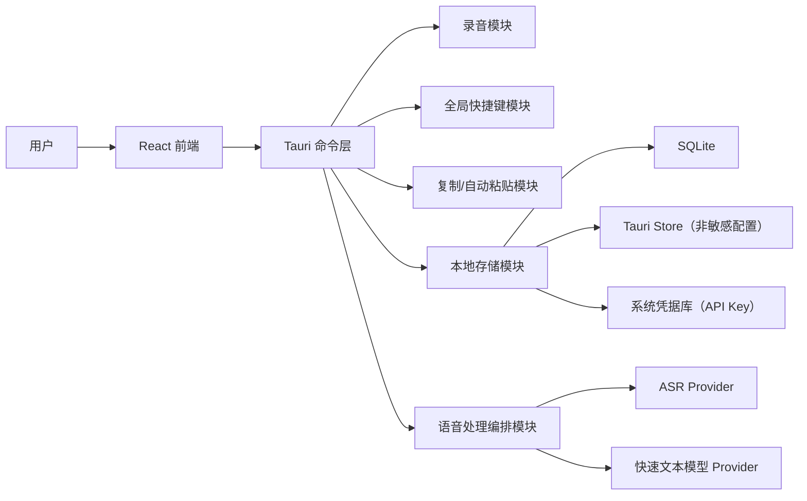
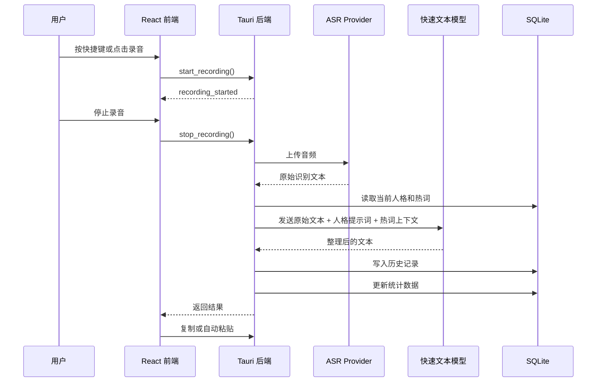

# XiLuoLin 技术方案设计

> 本文档基于 [requirements-analysis.md](./requirements-analysis.md) 编写，用于明确 XiLuoLin 的技术架构、模块划分、数据流、核心数据模型、关键流程和持续验证方式。

## 1. 设计目标

本项目目标是持续建设一个可靠、可解释、可复现、可扩展的开源桌面语音输入助手。

核心架构围绕以下稳定闭环建设：

```text
语音输入 → ASR 转写 → 快速文本模型按人格整理 → 复制或自动粘贴 → 历史保存 → 统计更新
```

设计原则：

- 优先完成办公、写作和编程场景下的短语音输入闭环。
- 当前默认采用云端 Provider，ASR 和文本整理均可选择智谱或 OpenAI-compatible 服务，同时保持模型名和接口地址可配置。
- 保留 Provider 抽象，后续可扩展本地离线 ASR 或更多模型服务。
- 本地保存人格、热词、历史和统计数据，降低隐私风险。
- 不做完整系统级输入法内核，不做会议纪要和长音频转写。

## 2. 总体架构

项目采用桌面助手形态，技术路线为 Tauri + React + Tailwind CSS + shadcn/ui。



### 2.1 前端职责

React 前端负责所有用户可见交互：

- 录音入口和录音状态展示。
- 人格选择、默认人格选择和自定义人格管理。
- 识别结果、整理结果和轻量编辑确认。
- 历史记录列表。
- 数据统计卡片。
- 热词词典管理。
- 模型服务、快捷键和输出方式设置。

前端按业务领域使用 controller hooks 管理状态：`recording`、`history`、`persona`、`hotword` 和 `config`。`App` 只负责页面组合与导航；录音 controller 使用显式阶段并统一处理快捷键和应用内录音完成流程。设置页通过 props、callback 和 revision 显式刷新就绪状态与录音存储统计，不依赖全局 DOM 自定义事件。

Rust command、event 和跨 IPC 数据类型通过 Specta 生成 `src/generated/tauri-bindings.ts`。前端只能通过生成的 `commands` 和 `events` 调用 Tauri，生成文件由 `pnpm bindings:check` 在 CI 中检查漂移。

前端 UI 基础选择 shadcn/ui + Tailwind CSS。shadcn/ui 组件以源码形式进入项目，适合根据桌面语音输入助手的产品气质做局部定制；Tailwind CSS 负责布局、间距、状态和设计 token。按产品需求添加组件，优先覆盖按钮、选择器、输入框、卡片、标签页、弹窗和开关。

性能边界：

- 不一次性引入完整组件集合，只通过 shadcn/ui CLI 添加当前任务需要的组件。
- Tailwind class 使用完整可静态识别的写法，避免动态拼接 class，保证构建阶段能生成正确 CSS。
- 对话框、选择器等复杂交互优先使用 shadcn/ui 底层的 Radix primitives，减少自写键盘交互和无障碍逻辑。
- 图标、动画和状态组件按场景引入，避免无关依赖和包体积增长。

视觉风格边界：

- 当前阶段以桌面效率工具为主，界面应保持清晰、克制、可扫描。
- 当前采用 `https://getdesign.md/notion/design-md` 作为视觉参考，取其 warm minimalism、soft surfaces 和高可读文本层级。
- 已评估 `https://getdesign.md/hp/design-md`。该风格适合企业官网和产品目录页，完整注入会让当前工具界面偏营销化。
- 项目不采用大面积斜切装饰、商品展示式布局或强品牌化视觉元素。

### 2.2 Tauri 后端职责

Tauri 后端负责系统能力和核心编排：

- 录音开始、停止、音频文件生成和口述时长统计。
- 全局快捷键注册，支持长按录音和切换式录音。
- 调用 ASR Provider 生成原始识别文本。
- 调用快速文本模型 Provider 生成最终文本。
- 复制文本到剪贴板。
- 自动粘贴到当前输入位置。
- 读写 SQLite、Tauri Store 和系统凭据库。
- 统一处理流程状态和错误信息。

### 2.3 本地编排策略

项目采用本地编排。桌面端直接调用 ASR 和快速文本模型服务，不引入自建后端。

原因：

- 架构清晰且部署边界简单，便于个人维护和开源贡献者理解。
- 历史、人格、热词和统计可以默认留在用户本地。
- 减少服务器部署、鉴权、日志和隐私声明成本。
- 后续如需统一云端能力，可以在 Provider 层扩展代理服务。

## 3. 核心流程设计

### 3.1 首次使用流程

1. 用户打开应用。
2. 用户配置智谱 ASR Provider，包括 API Key、Base URL 和模型名 `glm-asr-2512`。
3. 用户配置 OpenAI 文本模型 Provider，包括 API Key、模型名和必要生成参数。
4. 用户选择默认人格。
5. 用户按需配置快捷键、输出方式和热词词典。
6. 系统保存配置，并进入主界面。

首次使用不强制用户配置自定义人格。系统内置人格用于保证应用首次启动后即可进入实际使用流程。

### 3.2 日常语音输入流程



### 3.3 长按录音流程

长按模式适合短句输入。

- 按下快捷键：开始录音。
- 松开快捷键：停止录音并进入处理流程。
- 处理完成后：按用户配置复制或自动粘贴。

### 3.4 切换式录音流程

切换模式适合长段口述。

- 第一次按快捷键：开始录音。
- 第二次按快捷键：停止录音并进入处理流程。
- 处理完成后：按用户配置复制或自动粘贴。

### 3.5 输出流程

系统支持两种输出方式：

- 复制到剪贴板。
- 自动粘贴到当前输入位置。

自动粘贴失败时，系统保留复制结果作为兜底，并在界面上提示用户可手动粘贴。

## 4. 模块设计

### 4.1 录音模块

录音模块负责采集用户麦克风输入，并生成可发送给 ASR Provider 的音频文件。

能力要求：

- 开始录音。
- 停止录音。
- 返回应用录音目录中的临时文件路径或二进制数据。
- 处理前校验录音文件必须位于应用录音目录，拒绝目录穿越和外部路径。
- 处理结束后删除应用生成的临时 WAV；用户选择的外部音频不由该清理流程删除。
- 返回录音时长。
- 通知前端录音中、处理中、失败等状态。

当前核心链路优先支持短音频输入，避免处理会议、播客等长音频。

### 4.2 快捷键模块

快捷键模块负责注册和监听全局快捷键。

能力要求：

- 用户可配置快捷键。
- 支持长按模式。
- 支持切换模式。
- 发生快捷键冲突时给出提示。

当前版本提供默认快捷键，并在设置页允许用户修改。

### 4.3 Provider 模块

Provider 模块分为 ASR Provider 和快速文本模型 Provider。

当前默认 Provider 组合为：

| 能力 | Provider | 模型 / 接口 | 选择原因 |
|---|---|---|---|
| 语音转文本 | 智谱 GLM-ASR-2512 | `audio/transcriptions`，`model=glm-asr-2512` | 面向语音识别，支持音频输入和文本输出，适合短语音输入闭环 |
| 人格化文本整理 | 智谱或 OpenAI-compatible | `chat/completions`，模型名可配置 | 适合基于 system/user messages 做文本改写、结构整理和风格控制 |

这里保持 Provider 抽象。供应商选择只决定读取哪组 API Key、Base URL 和模型配置，不在 UI 中绑定固定模型名。

#### ASR Provider

ASR Provider 只负责语音转文本。

输入：

- 音频文件。
- 智谱 API Key。
- 模型名 `glm-asr-2512`。
- 是否流式返回。

输出：

- 原始识别文本。
- 可选识别语言。
- 可选处理耗时。

ASR 阶段不接收人格提示词，不做人格化改写。

当前默认使用非流式调用，原因是主流程需要在停止录音后拿到完整转写文本，再交给 OpenAI 做人格化整理。流式 ASR 可以作为后续优化，用于展示实时字幕或降低等待感。

#### 快速文本模型 Provider

快速文本模型 Provider 负责将原始识别文本整理成最终可用文本。

输入：

- 原始识别文本。
- 当前人格提示词。
- 热词词典上下文。
- 输出格式要求。

输出：

- 整理后的文本。

当前文本整理实现使用 OpenAI Responses API。请求中使用 `instructions` 承载固定系统要求和当前人格提示词，使用 `input` 承载 ASR 原始文本、热词上下文和输出要求。

当前数据流不把音频直接发送给 OpenAI，也不要求语音模型理解人格提示词。音频只进入智谱 ASR；OpenAI 只处理文本整理。

#### Provider 配置与降级原则

- ASR 与文本整理分别选择 Provider、Base URL 和模型，业务编排不绑定单一服务商。
- API Key 由系统凭据库保存，普通配置只保存非敏感字段和凭据引用。
- 调用层负责统一认证、请求结构、超时和错误转换；pipeline 只依赖稳定的 Provider 接口。
- ASR 失败时停止后续文本整理且不写入成功历史；文本整理失败时保留可理解的错误信息。
- 新 Provider 应复用现有抽象，并通过 mock HTTP 测试请求形状和响应解析。
- 本地离线 ASR 仍是路线图候选项，不属于当前已经实现的 Provider。

### 4.4 人格系统模块

人格是文本整理风格的核心配置。

当前人格系统支持两类人格：

- 系统内置人格。
- 用户自定义人格。

内置人格包括：

| 人格 | 场景 | 输出目标 |
|---|---|---|
| 通用人格 | 日常输入、聊天、自然表达 | 保持自然、清晰和口语化，精炼文本并移除整段末尾的单个句号 |
| Prompt 工程师 | Agent Prompt、编程辅助 | 明确目标、上下文、约束和输出格式 |
| 任务协作者 | 任务发布、需求沟通 | 拆分要求，语气清晰温和 |
| 灵感整理师 | 写作、创作、想法记录 | 提炼标题、要点、待办或草稿 |
| 正式消息助手 | 办公消息、邮件、回复 | 表达礼貌、准确、适合发送 |
| 翻译官 | 中英文转换 | 中文翻译为自然英文，英文仅清理润色 |

通用人格为首次安装时的默认人格，由系统维护，不允许编辑或删除；已有用户升级时保留其当前默认人格。

自定义人格允许用户配置：

- 名称。
- 描述。
- 适用场景。
- 输出语气。
- 输出结构。
- 默认提示词。
- 是否作为默认人格。

### 4.5 热词词典模块

热词词典用于减少专有名词、人名、项目名、技术词的误识别。

热词设计为本地词典：

- 用户可以新增、编辑、删除热词。
- 热词在快速文本模型整理阶段作为上下文注入。
- 对明确映射关系的热词，可以支持“原词 → 修正词”。

示例：

| 原词 | 修正词 | 分类 |
|---|---|---|
| next 点 js | Next.js | 技术词 |
| 七牛 | 七牛云 | 产品名 |
| codex | Codex | 工具名 |

### 4.6 历史记录模块

历史记录用于回看、复用和支撑统计。

每次成功生成文本后，系统写入一条历史记录。

历史记录至少保存：

- 原始识别文本。
- 整理后的文本。
- 使用人格。
- 录音时长。
- 生成字数。
- 输出方式。
- 创建时间。

当前提供最近历史列表，后续再扩展搜索、收藏和筛选。

### 4.7 统计模块

统计模块基于历史记录计算个人效率反馈。

当前展示以下统计卡片：

| 指标 | 计算方式 |
|---|---|
| 语音协作次数 | 成功生成结果的历史记录数量 |
| 累计口述时间 | 所有历史记录录音时长求和 |
| 口述生成字数 | 所有整理后文本字数求和 |
| 预计节省时间 | 按每分钟手动输入 80 个中文字估算 |
| 常用人格 | 按历史记录中的人格使用次数排序 |

预计节省时间只展示为估算，不作为精确生产力指标。

### 4.8 CaptureSession 与输出模块

快捷键录音开始时，Rust 创建只在本地内存存在的 CaptureSession，并保存 `session_id`、输入来源、处理状态和平台目标窗口快照。Windows 保存窗口句柄；macOS 保存前台应用 PID、Bundle ID 和 Accessibility 窗口指纹。原生信息不序列化给前端。

状态机：
当前输出模块支持：

```text
Recording → Transcribing → Refining → Delivering → Completed / Failed
```

录音状态窗在应用启动时预创建并隐藏，设置为不可聚焦和忽略鼠标事件。状态变化通过 Rust 直接更新窗口内容，避免状态窗抢走用户原输入位置。

最终文本通过 `deliver_text(session_id, text)` 投递：

1. 应用内录音只复制文本，不向外部窗口发送粘贴快捷键。
2. Windows 快捷键录音恢复目标窗口后模拟 `Ctrl+V`；macOS 在辅助功能权限允许时优先恢复原窗口，失败后退化为原应用，再发送 `Command+V`。
3. 自动粘贴前备份文本或图片剪贴板，成功后恢复原内容。
4. 目标窗口关闭、系统拒绝恢复或粘贴失败时，保留生成文本并提示手动粘贴。

macOS 自动投递前会确认前台 PID 与录音开始时的目标应用一致；权限不足、目标退出或焦点确认超时时不发送键盘事件。Windows 提升权限窗口受 UIPI 限制。两个平台都必须保留复制兜底。

### 4.9 设置模块

设置模块保存用户偏好和服务配置。

包括：

- 智谱 ASR 配置：API Key、Base URL、模型名、是否流式。
- OpenAI 文本模型配置：API Key、模型名、温度等生成参数。
- 默认人格。
- 录音模式。
- 快捷键。
- 输出方式。
- 是否自动保存历史。

API Key 不写入项目文件，不提交到 Git，也不明文保存在 Tauri Store。

## 5. 数据设计

项目使用 SQLite + Tauri Store + 系统凭据库。

Rust 数据层按 `models`、`database`、`persona_repository`、`hotword_repository`、`history_repository` 和 `commands` 拆分；`data/mod.rs` 保持公共 re-export，避免调用方依赖内部文件结构。

- SQLite：保存结构化业务数据。
- Tauri Store：保存 Provider、Base URL、模型名、默认人格 ID、快捷键等非敏感轻量配置。
- 系统凭据库：保存 ASR、OpenAI 和智谱文本 Provider 的 API Key；Windows 使用 Credential Manager，macOS 使用 Keychain。
- 兼容迁移：读取旧版明文配置时，先写入系统凭据库；全部写入成功后再清空 Tauri Store 中的密钥字段，迁移失败时保留旧配置并返回错误。

### 5.1 personas

保存系统内置人格和用户自定义人格。

| 字段 | 类型 | 说明 |
|---|---|---|
| id | text | 人格 ID |
| name | text | 人格名称 |
| description | text | 人格描述 |
| scene | text | 适用场景 |
| tone | text | 输出语气 |
| output_structure | text | 输出结构 |
| prompt | text | 默认提示词 |
| is_builtin | boolean | 是否内置 |
| is_default | boolean | 是否默认 |
| created_at | datetime | 创建时间 |
| updated_at | datetime | 更新时间 |

### 5.2 hotwords

保存热词词典。

| 字段 | 类型 | 说明 |
|---|---|---|
| id | text | 热词 ID |
| source_text | text | 可能误识别的词 |
| target_text | text | 推荐修正词 |
| category | text | 分类 |
| enabled | boolean | 是否启用 |
| created_at | datetime | 创建时间 |
| updated_at | datetime | 更新时间 |

### 5.3 history_records

保存语音输入历史。

| 字段 | 类型 | 说明 |
|---|---|---|
| id | text | 历史 ID |
| raw_text | text | ASR 原始识别文本 |
| final_text | text | 人格化整理后的文本 |
| persona_id | text | 使用的人格 ID |
| persona_name | text | 使用的人格名称快照 |
| duration_ms | integer | 录音时长 |
| output_chars | integer | 生成字数 |
| output_mode | text | 兼容字段，记录最终投递方式 |
| source | text | recording 或 upload |
| asr_provider | text | 实际 ASR Provider 快照 |
| asr_model | text | 实际 ASR 模型快照 |
| text_provider | text | 实际文本 Provider 快照 |
| text_model | text | 实际文本模型快照 |
| used_fallback | boolean | 是否使用文本降级 |
| delivery_method | text | pending、paste、copy 或 manual |
| audio_path | nullable text | 用户显式保留时的应用录音路径 |
| created_at | datetime | 创建时间 |

统计数据优先由历史记录实时计算，不单独维护复杂统计表。

### 5.4 本地 ASR 模型与降级

本地 Provider 使用 `whisper-rs` 0.16 和 whisper.cpp `ggml-base-q5_1.bin`。模型按需下载到应用数据目录，下载过程写入临时文件，完成大小校验后原子替换；支持状态、下载进度、加载验证和删除。

应用录音 WAV 在本地推理前转换为单声道 f32，并以线性插值重采样到 16 kHz。模型上下文按路径缓存，每次转写创建独立推理状态。whisper.cpp 日志通过官方 hook 重定向，避免输出用户识别内容。

`asr_provider = local` 时默认只调用本地模型。`allow_cloud_fallback` 默认 `false`；开启后，本地失败才使用 `fallback_asr_provider` 对应的云端配置。ASR 结果返回实际 Provider、模型和是否降级，历史记录保存这些快照。

## 6. Prompt 设计

文本整理请求使用 OpenAI-compatible `chat/completions` 结构，由三部分组成：

1. `system` message：固定系统要求、当前人格和热词上下文。
2. `user` message：用户原始识别文本。
3. 请求参数：短文本默认限制 `max_tokens=512`；智谱 Provider 默认发送 `thinking.type=disabled`，避免实时输入场景产生不必要的长推理。

基础要求：

- 保留用户原意。
- 自动补标点和断句。
- 去除明显口头禅和重复表达。
- 不编造用户没有表达的信息。
- 按人格要求输出。

Prompt 工程师人格示例目标：

```text
你是 Prompt 工程师。请把用户的口述内容整理成适合交给 AI Agent 执行的 Prompt。
输出时明确目标、上下文、约束和期望结果。
保持表达清晰、直接、可执行。
```

任务协作者人格示例目标：

```text
你是任务协作者。请把用户的口述内容整理成清晰、温和、可执行的任务说明。
输出时补全必要背景，拆分关键要求，避免命令式压迫感。
```

## 7. 错误处理设计

稳定版本需要覆盖以下失败场景：

| 场景 | 处理方式 |
|---|---|
| 未配置 API Key | 提示用户进入设置页配置 |
| 麦克风权限缺失 | 提示开启系统麦克风权限 |
| 录音失败 | 保持当前页面，允许重新录音 |
| ASR 调用失败 | 展示错误信息，不写入历史 |
| 快速文本模型调用失败 | 保留原始识别文本，允许复制原文或重试整理 |
| 自动粘贴失败 | 文本已复制到剪贴板，提示用户手动粘贴 |
| 数据库写入失败 | 展示保存失败提示，不影响结果复制 |

## 8. 安全与隐私设计

项目默认不上传历史记录、人格、热词和统计数据。

需要明确说明：

- 音频会发送给用户配置的 ASR Provider。
- 原始识别文本会发送给用户配置的快速文本模型 Provider。
- API Key 保存在操作系统凭据库中，不明文写入 `settings.json`。
- 旧版明文 API Key 仅在系统凭据写入成功后清理，避免迁移失败造成数据丢失。
- 历史记录和统计数据保存在本地 SQLite。
- 应用录音只允许在应用录音目录内处理；默认在成功或失败后清理。
- 仅当 `retain_recordings`、自动历史和历史写入均成功时保留 WAV；删除历史或清理全部录音时同步解除关联。
- 日志不输出 API Key 片段、用户文本或完整录音路径。
- 仓库中不保存真实 API Key。

## 9. UI 信息架构

当前应用采用左侧导航结构，包含首页、人格、热词、设置四个页面。页面内容按用户任务聚合，避免把模型配置、人格管理和热词管理堆叠在同一个主界面。

### 9.1 首页

当前首页聚焦输入结果和效率反馈：

- 当前人格问候和人格说明。
- 快捷键提示，优先显示长按模式快捷键，其次显示切换模式快捷键。
- 统计卡片：语音协作次数、累计口述时间、口述生成字数、预计节省时间、常用人格。
- 最近历史记录，按今天、昨天和具体日期分组。
- 每条历史记录展示人格、创建时间、录音时长、生成字数和整理结果摘要。
- 每条历史记录支持复制和删除。

录音快速开始卡片已保留为组件，但当前首页可见结构暂时隐藏该入口。Rust 侧为快捷键录音建立 CaptureSession 并发出携带 `session_id` 的完成事件；前端串联 `process_recording_file`、`deliver_text`、历史刷新和错误提示。状态窗由 `public/indicator.html` 提供并在启动时预创建，不主动获取焦点。真实服务 smoke test、Windows 跨权限级别粘贴和首页可见输入入口仍需继续验证。

### 9.2 人格页

- 内置人格列表。
- 自定义人格列表。
- 新建人格。
- 编辑自定义人格。
- 删除自定义人格。
- 设置默认人格。

### 9.3 热词页

- 热词列表，以“原始说法 → 修正写法”展示。
- 分类标签。
- 新增热词。
- 编辑热词。
- 删除热词。
- 启用或停用热词。
- 展示启用热词生成的 prompt 上下文。

### 9.4 设置页

设置页分为“通用”和“模型配置”两个 Tab：

- 通用：长按模式快捷键、切换模式快捷键、麦克风设备、录音时静音其他应用、输出方式、自动保存历史。
- 模型配置：智谱 GLM-ASR-2512 API Key、Base URL、模型名；OpenAI Responses API Key、Base URL、模型名。

设置保存后通过 toast 提示结果。API Key 输入框使用密码模式，后端将密钥写入系统凭据库，前端配置结构保持兼容。

设置页顶部提供输入就绪卡片，通过 `read_input_readiness` 检查：

- 默认麦克风是否可用。
- 当前 ASR Provider 的 API Key、Base URL 和模型是否完整。
- 当前文本 Provider 的 API Key、Base URL 和模型是否完整。
- 至少一个全局快捷键是否真实注册成功。
- 当前平台的自动粘贴和目标窗口恢复能力。

`models_ready` 供上传音频入口使用；`can_process` 额外要求麦克风；`can_dictate` 再额外要求快捷键。自动粘贴是非阻断能力，失败时继续使用剪贴板兜底。配置保存或本地模型变化后，由设置页显式增加 refresh revision 刷新检查，也支持用户手动重新检查；不周期轮询系统凭据库。

通用设置提供 `retain_recordings` 开关，默认关闭且依赖自动保存历史。录音存储卡片展示应用管理 WAV 的数量、占用空间和目录，并提供打开目录和清理全部操作；活跃 CaptureSession 期间禁止清理。

历史记录若存在 `audio_path`，前端可通过受管读取命令试听，并使用当前 ASR、文本 Provider 和默认人格重新转写；更新原记录但保留录音关联、来源和既有投递方式。所有历史记录都可直接使用 `raw_text` 和当前人格重新整理，不依赖录音。

## 10. 持续开发拆分建议

建议按可合并 PR 拆分：

1. 初始化 Tauri + React 项目结构，补充 README 运行说明。
2. 实现本地数据层，包含人格、热词和历史记录表。
3. 实现内置人格和人格选择。
4. 建立 shadcn/ui + Tailwind 前端基础，迁移已有人格选择界面。
5. 实现智谱 GLM-ASR-2512 配置与调用。
6. 实现 OpenAI Responses API 配置与人格化整理。
7. 实现录音、转写、整理、复制的主流程。
8. 实现历史记录和统计卡片。
9. 实现快捷键、自动粘贴和错误兜底。
10. 补充用户文档、依赖说明、贡献指南和隐私边界说明。
11. 执行桌面端端到端验证，确认导航、首页、人格页、热词页、设置页和真实语音输入路径可稳定使用。

每个 PR 应只做一件事，并在 PR 描述中写明功能描述、实现思路和测试方式。

## 11. 验证方案

版本验收需要覆盖以下路径：

- 首次启动后可以配置智谱 GLM-ASR-2512 和 OpenAI 文本模型。
- 用户可以选择默认人格。
- 用户可以创建自定义人格。
- 用户可以完成一次短语音输入。
- 系统可以返回 GLM-ASR-2512 的原始识别文本。
- 系统可以根据当前人格生成整理后的文本。
- 用户可以复制最终文本。
- 自动粘贴失败时复制结果仍可用。
- 历史记录成功保存。
- 统计卡片随历史记录更新。
- 热词可以作为上下文参与文本整理。
- API Key 不出现在 Git 跟踪文件中。

当前代码状态下，短语音输入路径还需要先恢复可见入口或接入快捷键事件监听，才能完整执行以上验收路径。

## 12. 后续扩展

后续迭代可在不推翻当前架构的前提下扩展：

- 本地离线 ASR Provider（已实现 Whisper Base Q5_1，云端降级默认关闭）。
- 更多云端 ASR Provider。
- 本地 LLM 或私有化文本模型。
- 人格导入导出。
- 热词批量导入导出。
- 历史搜索、收藏和筛选。
- 按人格、日期和场景查看统计趋势。
- 用户自定义平均打字速度。
- 更强的悬浮窗和跨应用输入体验。

## 13. 方案结论

当前项目选择 Tauri + React 桌面助手，本地编排语音输入流程，云端优先接入智谱 GLM-ASR-2512 和 OpenAI 文本模型。系统通过人格配置实现不同场景下的文本整理，通过热词、历史记录和统计卡片增强专业场景可用性和长期使用价值。

该方案控制了范围，避免过早进入系统级输入法、模型训练和长音频处理，同时保留 Provider 抽象和本地数据结构，为后续扩展本地离线能力、更多模型服务和更完整桌面体验留下空间。
