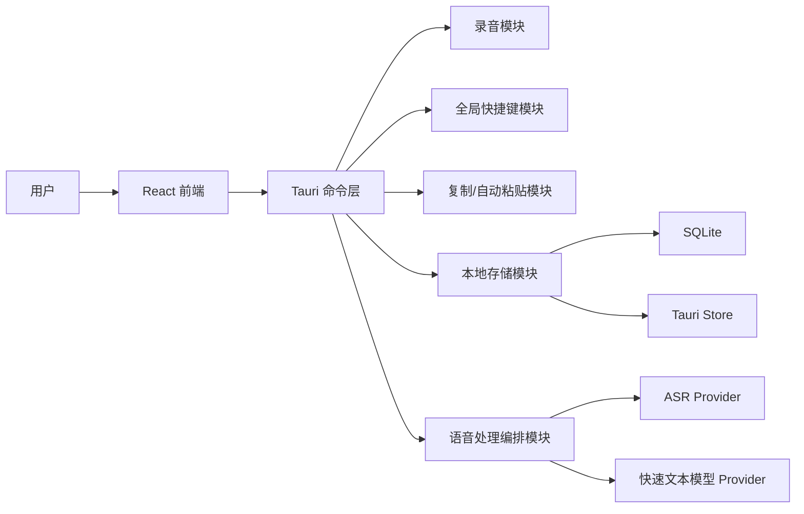
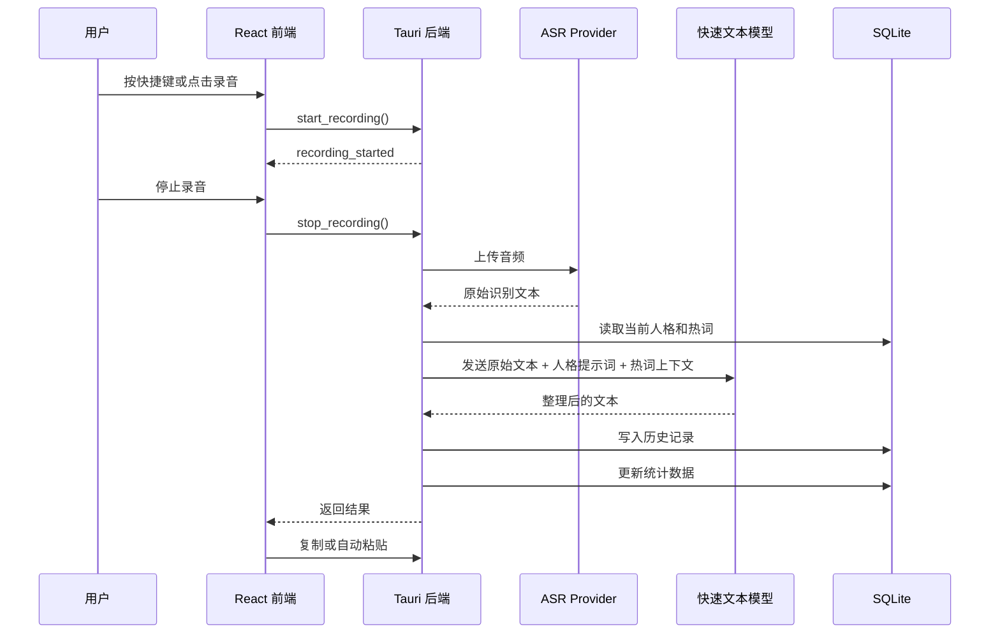

# AI 语音输入法方案设计

> 本文档基于 [requirements-analysis.md](./requirements-analysis.md) 编写，用于明确 MVP 阶段的技术架构、模块划分、数据流、核心数据模型、关键流程和验证方式。

## 1. 设计目标

本项目 MVP 目标是做出一个可演示、可解释、可复现的桌面语音输入助手。

第一阶段重点跑通以下闭环：

```text
语音输入 → ASR 转写 → 快速文本模型按人格整理 → 复制或自动粘贴 → 历史保存 → 统计更新
```

设计原则：

- 优先完成办公、写作和编程场景下的短语音输入闭环。
- 采用云端优先方案，MVP 阶段选用智谱 GLM-ASR-2512 作为 ASR Provider，选用 OpenAI 作为快速文本模型 Provider。
- 保留 Provider 抽象，后续可扩展本地离线 ASR 或更多模型服务。
- 本地保存人格、热词、历史和统计数据，降低隐私风险。
- 不做完整系统级输入法内核，不做会议纪要和长音频转写。

## 2. 总体架构

MVP 采用桌面助手形态，技术路线为 Tauri + React + Tailwind CSS + shadcn/ui。



### 2.1 前端职责

React 前端负责所有用户可见交互：

- 录音入口和录音状态展示。
- 人格选择、默认人格选择和自定义人格管理。
- 识别结果、整理结果和轻量编辑确认。
- 历史记录列表。
- 数据统计卡片。
- 热词词典管理。
- 模型服务、快捷键和输出方式设置。

前端 UI 基础选择 shadcn/ui + Tailwind CSS。shadcn/ui 组件以源码形式进入项目，适合根据桌面语音输入助手的产品气质做局部定制；Tailwind CSS 负责布局、间距、状态和设计 token。MVP 阶段按需添加组件，优先覆盖按钮、选择器、输入框、卡片、标签页、弹窗和开关。

性能边界：

- 不一次性引入完整组件集合，只通过 shadcn/ui CLI 添加当前任务需要的组件。
- Tailwind class 使用完整可静态识别的写法，避免动态拼接 class，保证构建阶段能生成正确 CSS。
- 对话框、选择器等复杂交互优先使用 shadcn/ui 底层的 Radix primitives，减少自写键盘交互和无障碍逻辑。
- 图标、动画和状态组件按场景引入，避免为 MVP 主流程增加无关包体积。

视觉风格边界：

- 当前阶段以桌面效率工具为主，界面应保持清晰、克制、可扫描。
- 当前采用 `https://getdesign.md/notion/design-md` 作为视觉参考，取其 warm minimalism、soft surfaces 和高可读文本层级。
- 已评估 `https://getdesign.md/hp/design-md`。该风格适合企业官网和产品目录页，完整注入会让当前工具界面偏营销化。
- 项目不采用大面积斜切装饰、商品展示式布局或强品牌化视觉元素。

### 2.2 Tauri 后端职责

Tauri 后端负责系统能力和核心编排：

- 录音开始、停止、音频文件生成和口述时长统计。
- 全局快捷键注册，支持长按录音和切换式录音。
- 调用 ASR Provider 生成原始识别文本。
- 调用快速文本模型 Provider 生成最终文本。
- 复制文本到剪贴板。
- 自动粘贴到当前输入位置。
- 读写 SQLite 和 Tauri Store。
- 统一处理流程状态和错误信息。

### 2.3 本地编排策略

MVP 采用本地编排。桌面端直接调用 ASR 和快速文本模型服务，不引入自建后端。

原因：

- 架构更轻，适合黑客松快速交付。
- 历史、人格、热词和统计可以默认留在用户本地。
- 减少服务器部署、鉴权、日志和隐私声明成本。
- 后续如需统一云端能力，可以在 Provider 层扩展代理服务。

## 3. 核心流程设计

### 3.1 首次使用流程

1. 用户打开应用。
2. 用户配置智谱 ASR Provider，包括 API Key、Base URL 和模型名 `glm-asr-2512`。
3. 用户配置 OpenAI 文本模型 Provider，包括 API Key、模型名和必要生成参数。
4. 用户选择默认人格。
5. 用户按需配置快捷键、输出方式和热词词典。
6. 系统保存配置，并进入主界面。

首次使用不强制用户配置自定义人格。系统内置人格可以保证应用开箱可演示。

### 3.2 日常语音输入流程



### 3.3 长按录音流程

长按模式适合短句输入。

- 按下快捷键：开始录音。
- 松开快捷键：停止录音并进入处理流程。
- 处理完成后：按用户配置复制或自动粘贴。

### 3.4 切换式录音流程

切换模式适合长段口述。

- 第一次按快捷键：开始录音。
- 第二次按快捷键：停止录音并进入处理流程。
- 处理完成后：按用户配置复制或自动粘贴。

### 3.5 输出流程

系统支持两种输出方式：

- 复制到剪贴板。
- 自动粘贴到当前输入位置。

自动粘贴失败时，系统保留复制结果作为兜底，并在界面上提示用户可手动粘贴。

## 4. 模块设计

### 4.1 录音模块

录音模块负责采集用户麦克风输入，并生成可发送给 ASR Provider 的音频文件。

能力要求：

- 开始录音。
- 停止录音。
- 返回录音文件路径或二进制数据。
- 返回录音时长。
- 通知前端录音中、处理中、失败等状态。

MVP 建议优先支持短音频输入，避免处理会议、播客等长音频。

### 4.2 快捷键模块

快捷键模块负责注册和监听全局快捷键。

能力要求：

- 用户可配置快捷键。
- 支持长按模式。
- 支持切换模式。
- 发生快捷键冲突时给出提示。

MVP 可先提供默认快捷键，并在设置页允许用户修改。

### 4.3 Provider 模块

Provider 模块分为 ASR Provider 和快速文本模型 Provider。

MVP 阶段的 Provider 选型固定为：

| 能力 | Provider | 模型 / 接口 | 选择原因 |
|---|---|---|---|
| 语音转文本 | 智谱 GLM-ASR-2512 | `audio/transcriptions`，`model=glm-asr-2512` | 面向语音识别，支持音频输入和文本输出，适合短语音输入闭环 |
| 人格化文本整理 | OpenAI | Responses API | 适合基于 `instructions` 和 `input` 做文本改写、结构整理和风格控制 |

这里保持 Provider 抽象，但 MVP 不做多 Provider 切换。第一阶段先把智谱 ASR + OpenAI 文本整理链路跑通，后续再扩展 OpenAI-compatible、其他 ASR 服务或本地离线能力。

#### ASR Provider

ASR Provider 只负责语音转文本。

输入：

- 音频文件。
- 智谱 API Key。
- 模型名 `glm-asr-2512`。
- 是否流式返回。

输出：

- 原始识别文本。
- 可选识别语言。
- 可选处理耗时。

ASR 阶段不接收人格提示词，不做人格化改写。

MVP 默认使用非流式调用，原因是主流程需要在停止录音后拿到完整转写文本，再交给 OpenAI 做人格化整理。流式 ASR 可以作为后续优化，用于展示实时字幕或降低等待感。

#### 快速文本模型 Provider

快速文本模型 Provider 负责将原始识别文本整理成最终可用文本。

输入：

- 原始识别文本。
- 当前人格提示词。
- 热词词典上下文。
- 输出格式要求。

输出：

- 整理后的文本。

MVP 使用 OpenAI Responses API。请求中使用 `instructions` 承载固定系统要求和当前人格提示词，使用 `input` 承载 ASR 原始文本、热词上下文和输出要求。

第一阶段不把音频直接发送给 OpenAI，也不要求语音模型理解人格提示词。音频只进入智谱 ASR；OpenAI 只处理文本整理。

### 4.4 人格系统模块

人格是文本整理风格的核心配置。

MVP 支持两类人格：

- 系统内置人格。
- 用户自定义人格。

内置人格包括：

| 人格 | 场景 | 输出目标 |
|---|---|---|
| Prompt 工程师 | Agent Prompt、编程辅助 | 明确目标、上下文、约束和输出格式 |
| 任务协作者 | 任务发布、需求沟通 | 拆分要求，语气清晰温和 |
| 灵感整理师 | 写作、创作、想法记录 | 提炼标题、要点、待办或草稿 |
| 正式消息助手 | 办公消息、邮件、回复 | 表达礼貌、准确、适合发送 |

自定义人格允许用户配置：

- 名称。
- 描述。
- 适用场景。
- 输出语气。
- 输出结构。
- 默认提示词。
- 是否作为默认人格。

### 4.5 热词词典模块

热词词典用于减少专有名词、人名、项目名、技术词的误识别。

MVP 设计为本地词典：

- 用户可以新增、编辑、删除热词。
- 热词在快速文本模型整理阶段作为上下文注入。
- 对明确映射关系的热词，可以支持“原词 → 修正词”。

示例：

| 原词 | 修正词 | 分类 |
|---|---|---|
| next 点 js | Next.js | 技术词 |
| 七牛 | 七牛云 | 产品名 |
| codex | Codex | 工具名 |

### 4.6 历史记录模块

历史记录用于回看、复用和支撑统计。

每次成功生成文本后，系统写入一条历史记录。

历史记录至少保存：

- 原始识别文本。
- 整理后的文本。
- 使用人格。
- 录音时长。
- 生成字数。
- 输出方式。
- 创建时间。

MVP 优先提供最近历史列表，后续再扩展搜索、收藏和筛选。

### 4.7 统计模块

统计模块基于历史记录计算个人效率反馈。

MVP 展示以下统计卡片：

| 指标 | 计算方式 |
|---|---|
| 语音协作次数 | 成功生成结果的历史记录数量 |
| 累计口述时间 | 所有历史记录录音时长求和 |
| 口述生成字数 | 所有整理后文本字数求和 |
| 预计节省时间 | 按每分钟手动输入 80 个中文字估算 |
| 常用人格 | 按历史记录中的人格使用次数排序 |

预计节省时间只展示为估算，不作为精确生产力指标。

### 4.8 输出模块

输出模块负责把最终文本送到用户实际输入场景。

MVP 支持：

- 写入剪贴板。
- 模拟粘贴。

自动粘贴存在系统权限和跨应用兼容问题，因此必须保留复制兜底。

### 4.9 设置模块

设置模块保存用户偏好和服务配置。

包括：

- 智谱 ASR 配置：API Key、Base URL、模型名、是否流式。
- OpenAI 文本模型配置：API Key、模型名、温度等生成参数。
- 默认人格。
- 录音模式。
- 快捷键。
- 输出方式。
- 是否自动保存历史。

API Key 不写入项目文件，不提交到 Git。

## 5. 数据设计

MVP 使用 SQLite + Tauri Store。

- SQLite：保存结构化业务数据。
- Tauri Store：保存智谱 API Key、智谱 Base URL、OpenAI API Key、OpenAI 模型名、默认人格 ID、快捷键等轻量配置。

### 5.1 personas

保存系统内置人格和用户自定义人格。

| 字段 | 类型 | 说明 |
|---|---|---|
| id | text | 人格 ID |
| name | text | 人格名称 |
| description | text | 人格描述 |
| scene | text | 适用场景 |
| tone | text | 输出语气 |
| output_structure | text | 输出结构 |
| prompt | text | 默认提示词 |
| is_builtin | boolean | 是否内置 |
| is_default | boolean | 是否默认 |
| created_at | datetime | 创建时间 |
| updated_at | datetime | 更新时间 |

### 5.2 hotwords

保存热词词典。

| 字段 | 类型 | 说明 |
|---|---|---|
| id | text | 热词 ID |
| source_text | text | 可能误识别的词 |
| target_text | text | 推荐修正词 |
| category | text | 分类 |
| enabled | boolean | 是否启用 |
| created_at | datetime | 创建时间 |
| updated_at | datetime | 更新时间 |

### 5.3 history_records

保存语音输入历史。

| 字段 | 类型 | 说明 |
|---|---|---|
| id | text | 历史 ID |
| raw_text | text | ASR 原始识别文本 |
| final_text | text | 人格化整理后的文本 |
| persona_id | text | 使用的人格 ID |
| persona_name | text | 使用的人格名称快照 |
| duration_ms | integer | 录音时长 |
| output_chars | integer | 生成字数 |
| output_mode | text | copy 或 paste |
| created_at | datetime | 创建时间 |

统计数据优先由历史记录实时计算，不单独维护复杂统计表。

## 6. Prompt 设计

OpenAI 文本整理请求由三部分组成：

1. `instructions`：固定系统要求和当前人格提示词。
2. `input`：用户原始识别文本。
3. `input` 中的辅助上下文：热词词典、输出格式要求和必要场景说明。

基础要求：

- 保留用户原意。
- 自动补标点和断句。
- 去除明显口头禅和重复表达。
- 不编造用户没有表达的信息。
- 按人格要求输出。

Prompt 工程师人格示例目标：

```text
你是 Prompt 工程师。请把用户的口述内容整理成适合交给 AI Agent 执行的 Prompt。
输出时明确目标、上下文、约束和期望结果。
保持表达清晰、直接、可执行。
```

任务协作者人格示例目标：

```text
你是任务协作者。请把用户的口述内容整理成清晰、温和、可执行的任务说明。
输出时补全必要背景，拆分关键要求，避免命令式压迫感。
```

## 7. 错误处理设计

MVP 需要覆盖以下失败场景：

| 场景 | 处理方式 |
|---|---|
| 未配置 API Key | 提示用户进入设置页配置 |
| 麦克风权限缺失 | 提示开启系统麦克风权限 |
| 录音失败 | 保持当前页面，允许重新录音 |
| ASR 调用失败 | 展示错误信息，不写入历史 |
| 快速文本模型调用失败 | 保留原始识别文本，允许复制原文或重试整理 |
| 自动粘贴失败 | 文本已复制到剪贴板，提示用户手动粘贴 |
| 数据库写入失败 | 展示保存失败提示，不影响结果复制 |

## 8. 安全与隐私设计

MVP 默认不上传历史记录、人格、热词和统计数据。

需要明确说明：

- 音频会发送给用户配置的 ASR Provider。
- 原始识别文本会发送给用户配置的快速文本模型 Provider。
- API Key 保存在本地配置中。
- 历史记录和统计数据保存在本地 SQLite。
- 仓库中不保存真实 API Key。

## 9. UI 信息架构

MVP 建议包含以下页面或区域：

### 9.1 主界面

- 当前人格选择。
- 录音按钮。
- 录音状态。
- 原始识别文本。
- 整理后文本。
- 复制按钮。
- 自动粘贴开关或输出方式选择。

### 9.2 历史页

- 最近输入历史。
- 每条历史展示人格、创建时间、录音时长和整理结果。
- 支持复制历史结果。

### 9.3 人格页

- 内置人格列表。
- 自定义人格列表。
- 新建人格。
- 编辑自定义人格。
- 设置默认人格。

### 9.4 热词页

- 热词列表。
- 新增热词。
- 编辑热词。
- 启用或停用热词。

### 9.5 统计页或首页卡片

- 语音协作次数。
- 累计口述时间。
- 口述生成字数。
- 预计节省时间。
- 常用人格。

### 9.6 设置页

- 智谱 GLM-ASR-2512 配置。
- OpenAI 文本模型配置。
- 快捷键配置。
- 录音模式配置。
- 输出方式配置。

## 10. MVP 开发拆分建议

建议按可合并 PR 拆分：

1. 初始化 Tauri + React 项目结构，补充 README 运行说明。
2. 实现本地数据层，包含人格、热词和历史记录表。
3. 实现内置人格和人格选择。
4. 建立 shadcn/ui + Tailwind 前端基础，迁移已有人格选择界面。
5. 实现智谱 GLM-ASR-2512 配置与调用。
6. 实现 OpenAI Responses API 配置与人格化整理。
7. 实现录音、转写、整理、复制的主流程。
8. 实现历史记录和统计卡片。
9. 实现快捷键、自动粘贴和错误兜底。
10. 补充演示文档、依赖说明和隐私边界说明。

每个 PR 应只做一件事，并在 PR 描述中写明功能描述、实现思路和测试方式。

## 11. 验证方案

MVP 验收需要覆盖以下路径：

- 首次启动后可以配置智谱 GLM-ASR-2512 和 OpenAI 文本模型。
- 用户可以选择默认人格。
- 用户可以创建自定义人格。
- 用户可以完成一次短语音输入。
- 系统可以返回 GLM-ASR-2512 的原始识别文本。
- 系统可以根据当前人格生成整理后的文本。
- 用户可以复制最终文本。
- 自动粘贴失败时复制结果仍可用。
- 历史记录成功保存。
- 统计卡片随历史记录更新。
- 热词可以作为上下文参与文本整理。
- API Key 不出现在 Git 跟踪文件中。

## 12. 后续扩展

后续迭代可在不推翻当前架构的前提下扩展：

- 本地离线 ASR Provider。
- 更多云端 ASR Provider。
- 本地 LLM 或私有化文本模型。
- 人格导入导出。
- 热词批量导入导出。
- 历史搜索、收藏和筛选。
- 按人格、日期和场景查看统计趋势。
- 用户自定义平均打字速度。
- 更强的悬浮窗和跨应用输入体验。

## 13. 方案结论

MVP 选择 Tauri + React 桌面助手，本地编排语音输入流程，云端优先接入智谱 GLM-ASR-2512 和 OpenAI 文本模型。系统通过人格配置实现不同场景下的文本整理，通过热词、历史记录和统计卡片增强专业场景可用性和 demo 表达力。

该方案控制了范围，避免过早进入系统级输入法、模型训练和长音频处理，同时保留 Provider 抽象和本地数据结构，为后续扩展本地离线能力、更多模型服务和更完整桌面体验留下空间。
